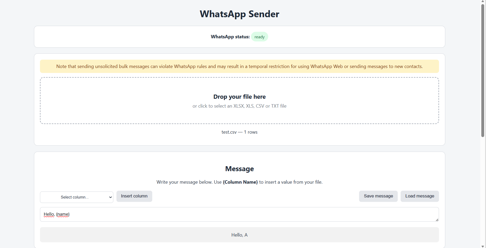

# whatsapp-sender
Send multiple WhatsApp messages using a template.

## Features
- Only scan QR code once to connect
- Drag and drop an Excel/CSV/TXT file with rows containing the phone numbers (and names)
- Create a template (such as `Hello {name}`) for messages
- Or use custom message for each row by adding a column to file and then setting template to be only `{column}`
- Optionally, an international prefix is automatically added to all numbers that don't have it

## Install and run
After cloning the repository or downloading it from Code --> Download ZIP,
- On Windows: double click `start_windows.bat`
- On Linux and MacOS: run command `sh start_linux_or_macos.sh`

## Acknowledgments
Thanks to [WhatsApp Web JS](https://github.com/wwebjs/whatsapp-web.js) project, used by this app for sending the messages.
